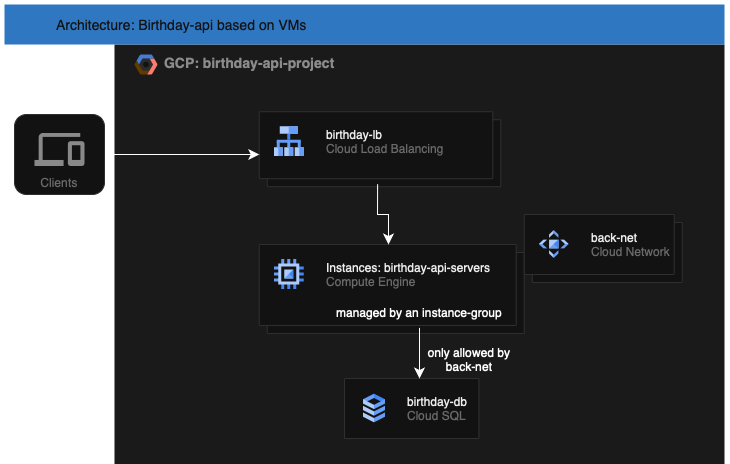

# Birthday-api

Birthday API: Stores your Date of Birth and counts how many days are left.

## Endpoints

### `GET /heatlh`

Returns the health of the api, confirming the db connection.

#### Response

```
[OK]
```

---

### `GET /hello/<username>`

Returns a greeting message and days until the next birthday.

#### Response

```json
{
  "message": "Hello, Jordi! Your birthday is in 128 day(s)"
}
```

---

### `PUT /hello/<username>`

Stores or updates the user's date of birth.

#### Request Body

```json
{
  "dateOfBirth": "1994-11-18"
}
```

---

## Local Dev environment

### Run it using compose (docker / podman)

```
podman compose -f docker-compose.yaml build
podman compose -f docker-compose.yaml up -d
```

> Note that for local environment, the database is also dockerized and it starts with a basic [schema](db/schema.sql).

### Tests:

```
podman build . --build-arg DB_HOST=127.0.0.1 --network host --target=tester
```

---

## Deploy it on GCP

Under deploy-files you have all files available to deploy the app on GCP:

- Using Compute instances
- Using kubernetes

In both cases, the database is running into a Cloud SQL Mysql instance

--- 

### Deploy birthday-api using terraform:

1. Create the birthday-ami:

```bash
cd deploy-files/packer
packer build --var project_id="XXXXXX" api-instance.pkr.hcl
```

This will create an image based on Ubuntu 24.04 amd64 with:

- Username: Birthday-api 
- Working Directory: /opt/birthday-api
- System daemon: birthday-api.service running the python code using `gunicorn`

1. Once you have the image deployed in your project you can run terraform to deploy the infrastructure:

```bash
cd deploy-files/terraform
terraform init
terraform apply --var project_id=XXXXXX --var image_name=birthday-api-1745172058
```

This terraform code will produces:

- Cloud SQL instance: MYSQL 8.4
  - MYSQL accesses + initialization of `users` table
- Compute Resources:
  - The instance template based on the image_name
  - The instance group pool to scale up and down
  - The Load Balancer to access to the birthday api endpoint (+ the correspondig healtcheck and configurations)
- Database user and password is stored in Google Secret Manager and obtained on terraform run time

#### Diagram of GCP resources



---

### Deploy birthday-api using kubernetes

Under `deploy-files/helm` you have available the code of the birthday-helm chart.
This helm chart allows you to create:

- Deployment to run the containerized version of the birthday-api
- Secrets to read the Database access information
- Ingress + Service to access to the endpoint externally